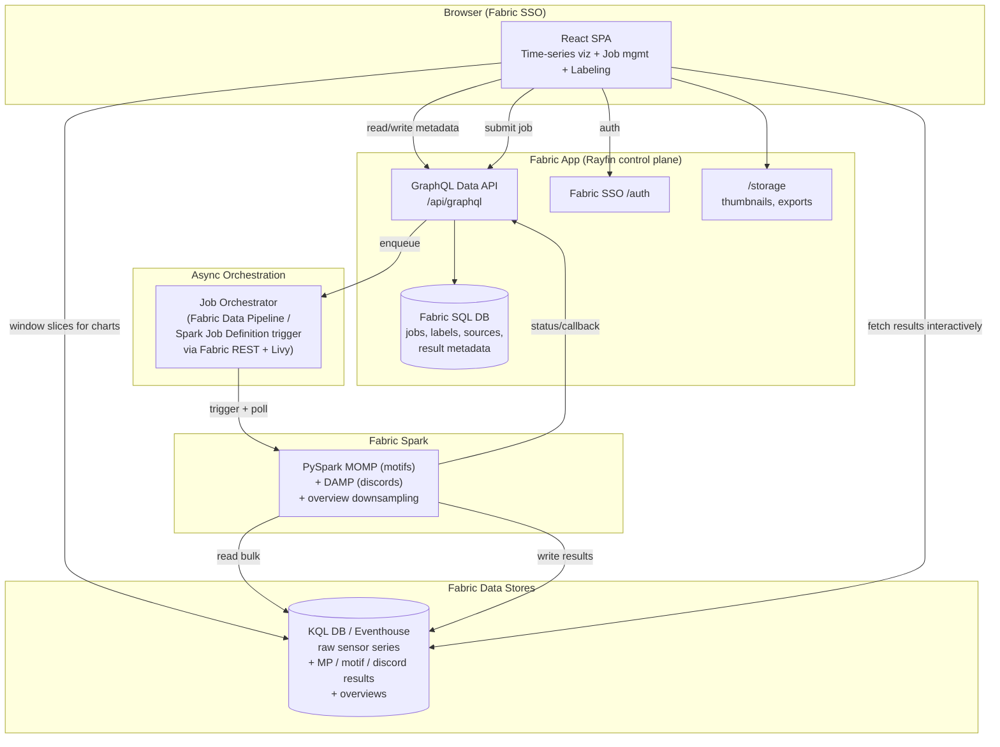

# Operations IQ — Microsoft Fabric (Rayfin) App

**Design Spec + Implementation Plan (no code in this phase)**

---

## 1. Problem Statement

Industrial sensor time series (vibration, temperature, pressure, current, flow, etc.)
contain recurring patterns (**motifs**) that signal normal operating regimes and rare
anomalies (**discords**) that signal faults, wear, or process upsets. The **Matrix
Profile (MP)** is the state-of-the-art primitive for finding both, but it is
(a) computationally expensive at scale and (b) inaccessible to non-technical users
(reliability engineers, process engineers, operators) who don't write code.

**Goal:** Operations IQ is a Microsoft Fabric App that democratizes Matrix Profile analytics — letting
non-technical users connect to sensor data in a **KQL database**, run **motif discovery
(MOMP)** and **discord discovery (DAMP-style)** as managed **Spark jobs**, and explore
and **label** the results through a highly interactive, best-in-class visualization UI.

**Design priorities (in order):** performance, accuracy, user experience.

---

## 2. Key Constraints & Platform Realities

These shape every architectural decision. Documented here so the design is grounded.

1. **Fabric Apps (preview) backend is opinionated.** A Rayfin app gives you:
   TypeScript data-model decorators → a **Fabric SQL database**, an auto-generated
   **GraphQL Data API** (`/api/graphql`), **Fabric SSO auth** (`/auth`), **file
   storage** (`/storage`), and **static frontend hosting**. It is *not* a general
   compute host — no long-running server processes, no stored procedures, no direct
   Spark execution inside the app runtime.
2. **Therefore the app is a control plane, not a compute plane.** Heavy MOMP/DAMP
   computation must run on **Fabric Spark** (notebooks / Spark Job Definitions),
   orchestrated *asynchronously* from the app. The app owns: UI, auth, job metadata,
   labels, and result caching. This is exactly why the user asked for a "job
   management module."
3. **KQL database is the sensor source of truth.** Raw high-frequency time series live
   in a Fabric Eventhouse/KQL DB (great for time-series ingest + range queries). The
   app reads *slices/windows* for visualization directly via KQL REST; Spark reads
   *bulk* series for computation.
4. **Results live in the KQL DB / Eventhouse (not OneLake).** Spark writes its outputs
   (matrix profiles, motif/discord indices, downsampled overviews) **back into the KQL
   database** via the Kusto Spark connector. This keeps *raw series and results in one
   store*, so the frontend retrieves results **interactively with fast KQL range
   queries** (the same access pattern it already uses for raw slices) instead of
   reading Delta/Parquet files. KQL's columnar + time-index engine is ideal for the
   "give me MP values between index a and b at zoom level z" queries the UI issues on
   every pan/zoom. (OneLake Delta is retained only as an optional cold-archive/export
   target, not the interactive path.)
5. **Preview + environment limits.** Full deploy needs Fabric capacity, tenant-admin
   enablement of the Fabric Apps workload, and the Rayfin CLI against a real workspace.
   This spec is deploy-ready in design but does not assume we can `rayfin up` from a
   local box today.

---

## 3. Personas & Core User Journeys

| Persona | Needs |
| --- | --- |
| **Reliability / process engineer** (primary, non-technical) | Pick a sensor + time range, find recurring patterns and anomalies, label them, share findings. |
| **Data engineer** (secondary) | Register KQL sources, manage compute pools, monitor jobs/costs. |
| **Analyst / data scientist** (power user) | Tune MOMP/DAMP params, compare runs, export results. |

**Golden path (primary persona) — a guided wizard (see §7.1):**
1. **"What do you want to find?"** — plain-language goal cards (repeating patterns,
   anomalies, regime changes, slow drift, cause→effect rules) map to a preset **recipe**.
2. Pick a **data source** (KQL table) → **signal/tag** → **time window** (with live
   preview and an instant, smooth downsampled overview chart).
3. **"How long is the pattern?"** answered in domain terms ("~2 seconds", not "m=512"),
   with a **live ghost-overlay preview** and an **"I'm not sure → auto length (Pan MP)"**
   default so novices never guess a number.
4. Set **sensitivity** with a friendly slider → **Run**. Thanks to **anytime execution**
   a best-so-far result appears in ~1s and refines live; the user can **stop when good
   enough** or set a **time budget**.
5. Results overlay on the series with plain-language framing (valleys = "most repeated,"
   peaks = "most unusual"), a **pattern inspector** (superimposed instances), a
   **significance badge**, and **guided next-step suggestions** if nothing strong appears.
6. **Label** a motif ("healthy pump cycle") or discord ("bearing spall") → saved,
   reusable, shareable, and **"apply to all similar."**

Every step carries a persistent "what does this mean?" explanation rail so no MP jargon
is required to succeed.

---

## 4. Target Architecture



**Layering summary**
- **Presentation:** React SPA (static-hosted by the app), Fabric SSO.
- **Control plane:** Rayfin GraphQL + SQL DB (job registry, labels, sources, result
  pointers). Small, transactional, metadata-only.
- **Orchestration:** app writes a `Job` row → an orchestrator (Fabric Data Pipeline or
  a lightweight scheduler calling the **Fabric Livy/Spark Job REST API**) picks it up,
  launches Spark, polls status, has Spark write results into the **KQL DB**, and calls
  back the GraphQL API to flip job state.
- **Compute plane:** PySpark implementations of **MOMP** (motifs) and **DAMP**
  (discords), plus an **overview/downsampling** job for fast charting.
- **Data plane:** KQL DB / Eventhouse holds **both** raw series **and** results
  (MP, motif/discord indices, overviews); results are keyed by `jobId` for fast
  interactive retrieval. OneLake is an optional export/archive target only.

---

## 5. Data Model (Rayfin `@entity` classes — control plane)

Metadata only; large arrays live in the **KQL DB**, keyed by `jobId` (see §5.1).
This section details the **core** entities that anchor the design; the shipped
schema (`rayfin/data/schema.ts`) assembles **21 entities** in total — the
remainder (e.g. `ConnectionProfile`, `SavedView`, `SavedDerivedMetric`,
`Annotation`, `ScenarioRun`, `ModelOutput`, `VsmModel`/`VsmModelTerm`,
`AlertRule`/`AlertEvent`) back specific pages and are documented in
[`docs-site` → Developer Guide → Data model](../../docs-site/docs/dev/data-model.md).

- **DataSource** — `id`, `name`, `kqlClusterUri`, `database`, `table`, `timeColumn`,
  `valueColumn`, `tagColumn?`, `defaultSampleRateHz`, `createdBy`, `createdAt`.
- **Signal** — logical tag within a source: `id`, `dataSourceId`, `tagName`, `unit`,
  `description`.
- **AnalysisJob** — the heart of the job-management module:
  `id`, `signalId`, `type` (`MOTIF_MOMP` | `DISCORD_DAMP` | `FULL_MP` | `PAN_MP` |
  `SEGMENTATION` | `CHAIN` | `AB_MOTIF` | `AB_DISCORD` | `MULTIDIM_MOTIF` |
  `MULTIDIM_DISCORD` | `MULTIDIM_SEGMENTATION` | `CONSENSUS_MOTIF`),
  `windowStart`, `windowEnd`, `subLen` (m; null when `PAN_MP` auto-scans length),
  `params` (JSON: dsr, exclusion zone, k, length-range, timeBudgetMs, approximation
  flags), `status` (`QUEUED|RUNNING|SUCCEEDED|FAILED|CANCELLED`),
  `progressPct`, `sparkAppId`, `resultKqlTable` (KQL table holding this job's arrays),
  `resultKey` (= `jobId`, the KQL partition/filter key), `overviewKqlTable`,
  `errorMessage`, `submittedBy`, `submittedAt`, `startedAt`, `finishedAt`,
  `computeSeconds`.
- **ResultArtifact** — summary stats + KQL pointer for a finished job: `id`, `jobId`,
  `kind` (`MATRIX_PROFILE|MOTIF_PAIRS|DISCORDS|OVERVIEW`), `kqlTable`, `resultKey`,
  `summary` (JSON: top-k indices, distances, bsf value). The `summary` (small) is
  cached in SQL for instant list rendering; full arrays are pulled from KQL on demand.
- **Label** — user annotation: `id`, `signalId`, `jobId?`, `kind` (`MOTIF|DISCORD`),
  `startIndex`, `length`, `text`, `category` (taxonomy), `color`, `confidence`,
  `createdBy`, `createdAt`. Row-level auth so users see org/shared labels.
- **LabelCategory** — reusable taxonomy per workspace (e.g. "Bearing fault",
  "Healthy cycle").
- **SignalMetadata** — governed, workspace-scoped definition of "normal / healthy"
  per tag: `id`, `signalId`, `scopeKey?`, operating envelope (`operatingSetpoint`,
  `upperOperatingLimit`, `lowerOperatingLimit`, `maxRateOfChange`), specification
  limits (`usl`, `lsl`, `target`), plausible physical range (`physicalMin`,
  `physicalMax`, `sensorUncertainty`), SPC binding (`activeBaselineId` → approved
  `SpcBaseline`, `preferredChartType`, `ruleProfile`), monitoring defaults
  (`recommendedAlertThreshold`, `recommendedConfidence`), `notes`, and governance
  columns (`status` = draft/approved/retired, `version`, `parentId`, `approvedBy`,
  `approvedAt`, `authoredBy`, append-only `auditJson`, `effectiveFrom/To`,
  `createdAt`, `updatedAt`). Shared read for all authenticated users; writes are
  gated and versioned/audited exactly like `SpcBaseline` (approve freezes a draft;
  revise creates a new version row rather than mutating an approved one). Managed on
  the **Signal Metadata** page; consumed as first-class limit fields by every
  analysis page and by the agent (`describe_tag`).

Row-level `@role` policies: users read/write their own jobs + labels; shared labels
visible org-wide; DataSource registration gated to data-engineer role.

**Governed-metadata surfacing (OneLake → KQL).** `SignalMetadata` persists to the
Fabric App SQL DB (RayFin), which is mirrored to OneLake. At deploy time, create a
OneLake shortcut to the mirrored `signal_metadata` table and expose it in the
Eventhouse as an external table `SignalMetadataExternal`. Point the profile's "Signal
Metadata" base query at the `METADATA_QUERY_WITH_SIGNAL_METADATA` template
(`src/lib/connectionProfile.ts`), which `leftouter join`s the external table with
`arg_max(version, *)` filtering, restricts to the active profile via
`scope_key == _ConnectionProfileId`, and projects the governed fields via
`column_ifexists(...)` — so profiles without the shortcut degrade gracefully. The app
also overlays governed values directly from RayFin onto the tag catalog on load
(`applySignalMetadataToTags`), so an editor's change is visible immediately regardless
of mirror latency; the KQL join is the eventually-consistent, agent-visible path.

**Annotation surfacing (SQL DB → timeline).** Annotations persist to the same Fabric
App SQL DB. Rather than routing them through the Eventhouse, the timeline reader
(`loadAnnotationMarkers` in `src/lib/annotations.ts`) fetches them **directly from the
SQL DB via the DAB/GraphQL client**, pushing all filtering to the database: the active
`connection_profile_id`, the selected `(scope_type, scope_id)` pairs, and a time-window
overlap identical to the Events query. Fetched timestamps are shifted by the active
query offset into chart space and merged with Eventhouse events in `loadTimeline`
(deduped by marker id, SQL annotation winning any KQL-sourced copy). This makes new
annotations appear immediately and removes the need to hand-wire an
`external_table("Annotations")` UNION into each profile's Events query. The legacy
`EVENTS_QUERY_WITH_ANNOTATIONS` template remains only for backward compatibility.

**Retrofit deployment (companion database).** To attach the app to an existing
Eventhouse without disturbing its KQL databases, deploy the app's functions and result
tables into a dedicated **companion** KQL database on the same Eventhouse
(`eventhouse/deploy/Retrofit-Eventhouse.ps1`). The raw sensor tables stay in the
customer's source database and are read cross-database from the connection profile's
canonical queries (`database("<SourceDatabase>").<Table>`, same cluster). Annotations
and governed metadata are read from the shared RayFin SQL DB and scoped to the active
profile in-query (see above), so no per-profile Eventhouse external-table wiring is
required. The connection-profile editor's **Validate components** action (read-only
probes) confirms the canonical queries and result tables — but not external tables,
which the app no longer depends on — before a profile is saved.

**Wide time-series profiles (query-time unpivot).** A profile can flag its
time-series source as **wide** (`timeseries_is_wide`): one row per
`(SignalIdPrefix, Timestamp)` with ≥ 2 arbitrarily-named `real` value columns,
instead of the narrow canonical `(SignalId, Timestamp, Value)`. The canonical signal
id is `SignalIdPrefix + <delimiter> + <value-column name>` (delimiter ≤ 3 chars,
default `-`, chosen to never appear in prefixes/column names so the split is
unambiguous). No value-column list is stored; the columns to expand are derived at
query time from the analysis's in-scope `SignalId`s.

The single injection point `withTimeseriesRef` (`src/lib/kql.ts`) rewrites the base
query into a `let Timeseries = (…)` binding that all ~35 downstream analysis builders
reference unchanged. It is **performance-first** — filters and projections are pushed
as early as possible so columns/rows the analysis will not use are never materialized:

1. run the user's base wide query;
2. early `where Timestamp between (window)` (from the scope) — emitted with **raw UTC**
   literals so it compares the source's *unshifted* `Timestamp` and Kusto's datetime
   index / extent elimination still applies;
3. early `where SignalIdPrefix in (<distinct in-scope prefixes>)`;
4. shift `Timestamp` into the preferred timezone (offset ≠ 0 only) — applied *after* the
   pre-filters (so only surviving rows are shifted) but *before* any binning, so
   `bin_at`/`bin`/`hourofday` align to the preferred zone's wall clock;
5. early `project SignalIdPrefix, Timestamp, <distinct in-scope value columns>` —
   drops value columns no in-scope signal references, so the materialized set is as
   narrow as possible;
6. `materialize` the filtered/projected base once;
7. `union` **one leg per distinct in-scope value column**, each projecting
   `SignalId = strcat(SignalIdPrefix, "<delim>", "Col")`, `Value = toreal(['Col'])`
   (so the union is bounded by column count, not signal count);
8. final `where SignalId in (<exact in-scope ids>)`.

The narrow path applies the same pushdown: `withTimeseriesRef` emits
`| where Timestamp between (<raw UTC bounds>)` ahead of the `| extend Timestamp = …`
shift whenever a scope is supplied. Downstream builders still re-filter the shifted
column with shifted literals; because `T + offset ∈ [s + offset, e + offset]` is
equivalent to `T ∈ [s, e]`, the pre-filter selects exactly the same rows and is purely
a cost optimization. `scope` is a covering bound of everything a builder reads (see
`tsScope` / `tsScope2`).

**Adaptive pre-aggregation (dense-data optimization).** For adaptive-binned analyses
— those whose whole `Timeseries` consumption is a single `make-series`/`summarize` at
a known grain (Explore, robust outliers, plain binned single/multi series) — the
builder passes a `WidePreAggregation { binKql, aggregation }` hint into
`withTimeseriesRef`. When present, step 5's raw column projection is replaced by an
early `summarize <col> = <agg>(<col>), … by SignalIdPrefix, Timestamp = bin_at(Timestamp,
<binKql>, <window start>)`, so the subset is **binned before it is materialized**. For
dense raw data this shrinks the materialized set from raw resolution to
~*(prefixes × bins)*. Correctness is preserved because `bin_at` is anchored to the
window start — the same fixed point the downstream `make-series … from <window start>
… step <binKql>` uses — so each downstream bin maps to exactly one pre-binned value
per signal and re-applying `avg`/`min`/`max`/`sum` over that single value is lossless.
`count` is not preservable this way (a pre-bin collapses to one row) and is ignored,
falling back to the raw projection; raw-count/coverage probes and OHLC candlestick
views never pass the hint, so they keep raw resolution.

Because the transform needs a bounded column/signal set, wide profiles **require an
explicit signal selection** on every analysis (bounded by the multi-select limit);
`withTimeseriesRef` throws if a wide analysis supplies no scope, enforcing the
no-whole-catalog guardrail. The Hierarchy/Metadata queries remain user-authored and
must emit matching `prefix + delimiter + column` `SignalId`s (there is no
auto-generated wide catalog). The editor's **Validate wide schema** action runs a
read-only `getschema` probe to confirm the fixed columns, the ≥ 2 numeric value
columns, and delimiter-collision safety.

**Wide density/coverage probes (pre-unpivot aggregation).** Two lightweight
probes — the raw-data-density estimate (`buildMaxTagCountQuery`, used to warn when a
chosen resolution over-samples the data) and the pre-flight `get_data_coverage`
summary (`buildCoverageQuery`) — consume the *raw, un-binned* series and so cannot
pre-bin before `materialize`. On a dense wide source, materializing the raw
unpivoted subset can exceed the 5 GB per-cluster materialized-results cap and fail.
Because canonical wide rows co-sample every value column against one `Timestamp`,
both probes are instead answered **directly on the wide base, before any unpivot**:

- **Density** — the raw record count of any signal derived from a prefix equals that
  prefix's wide row count, so the densest signal's count is
  `max(count() by SignalIdPrefix)`. This is a single streaming `summarize` with no
  `materialize` and no `union` at all.
- **Coverage** — per-column `min`/`max`/`count`/`sum` are reduced *by
  `SignalIdPrefix`* (one row per prefix), that small aggregate is `materialize`d, then
  unpivoted into the per-signal coverage rows (`AvgV` recovered as `sum/count`). Only
  the tiny per-prefix aggregate is ever materialized — never the raw rows —
  so the cap cannot be reached. `FirstTs`/`LastTs` are per-prefix (canonical wide
  co-samples every column, so they match each derived signal), and the final
  `where SignalId in (…)` trims the prefix×column grid to the exact requested signals.

Narrow profiles are unaffected: both probes keep their canonical
`let Timeseries = (…)` path.


### 5.1 KQL result schema (interactive retrieval)

Spark writes results into a small set of KQL tables (ingested via the Kusto Spark
connector). All are keyed by `jobId` and indexed on `idx` so the UI can issue fast
range/zoom queries.

- **`mp_result`** — one row per subsequence index:
  `jobId:string`, `idx:long`, `mp:real`, `mpi:long` (nearest-neighbor index),
  `ingestedAt:datetime`. Motif = min `mp`; discord = max `mp`.
- **`motif_pairs`** — `jobId`, `rank:int`, `idxA:long`, `idxB:long`, `dist:real`,
  `subLen:int`.
- **`motif_occurrences`** — every stretch matching a motif's shape (not only the pair):
  `jobId`, `rank:int` (ties back to `motif_pairs`), `occurrence:int`, `idx:long`,
  `dist:real`, `seriesId:long` (0/1 for AB-join A/B; null for single-series &
  multidimensional), `subLen:int`, `ingestedAt:datetime`. Computed by
  `tsmp.common.occurrences` (MASS distance profile of the motif's seed, thresholded at
  `dist × 1.5`); the review UI's "Show all occurrences" toggle highlights them all.
- **`discords`** — `jobId`, `rank:int`, `idx:long`, `nnDist:real`, `severity:real`.
- **`overview`** — multi-resolution envelopes: `jobId` (or `signalId+window`),
  `level:int`, `bucket:long`, `tMin:real`, `tMax:real`, `tAvg:real`. UI picks `level`
  by zoom.

Typical UI query pattern (interactive):
`mp_result | where jobId == "<id>" and idx between (a .. b) | order by idx asc`, or an
overview fetch filtered by `level`. KQL's time/columnar index makes these
sub-second even over millions of rows, which is why results live here rather than in
Delta files. Retention/caching policies on these tables are tuned per workspace;
optional export to OneLake for long-term archival.

---

## 6. The Algorithms (accuracy + performance core)

### 6.1 Background primitives
- **Matrix Profile (MP):** for subsequence length `m`, `MP[i]` = z-normalized Euclidean
  distance from subsequence `i` to its nearest non-trivial neighbor; `MPI[i]` = that
  neighbor's index. **Motif** = global min of MP (most similar pair). **Discord** =
  global max of MP (most isolated subsequence). Exclusion zone `~m/2` avoids trivial
  matches.
- **MASS:** FFT-based O(n log n) distance profile of one query vs the whole series —
  the parallel unit of work.
- **PAA:** piecewise aggregate approximation = downsampling by averaging; basis of MOMP.

### 6.2 MOMP for motifs (from the reference repo, adapted to Spark)
Reference flow (`momp.py` / `momp_utils.py`): start at downsample rate `dd = m/4`; loop:
1. `approxMP` — PAA-downsample T by `dd`, compute MP on the short series, upscale to a
   **lower-bound MP (uAMP)** via `sqrt(dd) * repeat(amp, dd)`.
2. `bsfMotif` — best-so-far motif value/loc from uAMP.
3. `refine` — compute exact local MP around candidate locations to tighten `bsf`.
4. `prune` — drop regions of T whose lower bound can't beat `bsf`.
5. `dd = dd // 2`; repeat on the pruned series until `dd == 1` → **exact** best motif.

Result: orders-of-magnitude fewer full-resolution distance computations, **exact**
answer preserved by the `lbMP` lower bound.

**Spark parallelization strategy (MOMP):**
- MOMP is *sequential across `dd` levels* but each level's MP computation is
  *embarrassingly parallel*. Parallelize **within a level**:
  - Partition the query subsequence index range across executors; each task runs
    MASS (FFT) for its block of queries against the (broadcast) series, emitting a
    partial MP; reduce by element-wise min + argmin. (STOMP/SCAMP-style diagonal or
    row-block decomposition.)
  - At coarse `dd` the downsampled series is tiny → run on the driver / single task
    (avoid Spark overhead). **Adaptive:** only fan out to Spark when the working set
    exceeds a threshold (e.g. pruned length × m² work units).
  - Broadcast the current (pruned) series + precomputed rolling means/stds so tasks
    are self-contained.
  - `refine` and `prune` are cheap and run on the driver between levels.
- **Extension — multi-segment / multi-signal batch:** across many signals or time
  windows, each independent MOMP run is a partition → trivially parallel at the job
  level (great for "scan a whole plant" workloads).

### 6.3 DAMP for discords (new, complementary)
MOMP's pruning is motif-preserving and cannot yield discords, so discords get their own
**DAMP (Discord Aware Matrix Profile)**-style design:
- DAMP finds the top discord by maintaining an evolving `bsf` discord distance and,
  for each candidate, computing its nearest-neighbor distance *incrementally* while
  **early-abandoning** any candidate that proves it's not more isolated than the
  current best — most candidates are rejected after a few dot products.
- Supports **top-k discords** with an exclusion zone between reported discords.
- **Spark parallelization (DAMP):**
  - **Segment-parallel with global reduce:** split the series into overlapping
    segments (halo = `m`), run DAMP per segment to get local discord candidates +
    their local NN distances, then a **global refine** pass verifies each surviving
    candidate's true nearest neighbor across the *full* series (bounded MASS calls) to
    avoid false positives at segment seams. Early-abandon keeps this cheap.
  - Broadcast series stats; candidates list is tiny → cheap reduce.
- **Accuracy guardrail:** the global refine pass guarantees reported discords equal the
  exact top-k discords (no seam artifacts).

### 6.4 Overview/downsampling job (UX enabler)
A dedicated lightweight Spark (or KQL-side) job produces **multi-resolution
downsampled overviews** (min/max/avg per bucket — "OHLC-style" envelopes) so the
frontend renders millions of points at 60fps by loading the right zoom level. Written
to the KQL `overview` table once, reused by all charts for that window.

### 6.5 Validation & accuracy strategy
- Port the reference `unit_test.py` cases; assert Spark-MOMP motif == reference motif
  on shared fixtures (`genData.py` random-walk + planted-motif data).
- Cross-check MP against **STUMPY** (`stumpy.stump`) on small windows as an
  independent oracle for both MP values and motif/discord indices.
- Numerical tolerance for z-normalized distances (float32 vs float64) documented.
- Determinism: fixed exclusion-zone + tie-break rules so results are reproducible.

### 6.6 Anytime / progressive execution & Pan Matrix Profile (UX-critical)

Two properties from the reference literature (Keogh, *Motif Mining in Time Series
Data*, 2025) directly power the guided UX and are first-class in the design:

- **Anytime / contract execution.** MOMP is *hyper-anytime*: on cooperative data it
  reaches ~99% of the final answer in ~1% of the runtime (degrading gracefully to
  SCRIMP++, still super-anytime, otherwise). The engine therefore emits a **best-so-far
  motif/discord early and refines it progressively**, streaming intermediate results to
  the UI. This is what makes analysis feel *interactive* even on huge series: the user
  sees a candidate in ~1 second, and a progress/quality curve shows convergence. Users
  can **stop early** ("good enough") or set a **time contract** ("give me the best
  answer in 30s"). Implemented by reporting the current `bsf` at each `dd` level (MOMP)
  / after each segment pass (DAMP).

  **Delivered streaming mechanism.** Livy provides no server→client push channel, so the
  best-so-far stream is carried through KQL: the Spark driver ingests every improving
  `ProgressEvent` as a row in a dedicated **`job_progress`** table
  (`{jobId, pct, stage, bestDist, bestIdxA, bestIdxB, subLen, updatedAt}`, tight 5s
  ingestion batching) via `tsmp.jobs.spark_entry._kql_progress_sink`. The SPA polls
  `job_progress | order by updatedAt desc | take 1` every 5s while the job runs, drives
  the convergence meter from the real `pct`/`stage`, and renders the partial motif from
  the snapshot — well before the final `motif_pairs`/`overview` rows are ingested. Writes
  are strictly best-effort (a missing table or transient failure never fails the job).
  **Stop-early** cancels the Livy statement (freeing Spark capacity) and marks the job
  `CANCELLED` while *retaining* the last `job_progress` snapshot, so the review view keeps
  showing the accepted best-so-far. *Limitation:* only the serial driver anytime path
  (small/interactive windows) streams fine-grained levels. The distributed diagonal-block
  path taken for very long windows computes the full profile before extracting motifs, so
  it emits only coarse stage/pct progress plus the final result; fine-grained streaming
  for that path is future work.
- **Pan Matrix Profile (PMP) — removes the need to guess the motif length.** The single
  required parameter is `m` (motif length). PMP computes motifs across a *range* of
  lengths and surfaces the best ones automatically, so a non-technical user never has
  to pick a number. Offered as a job type (`PAN_MP`) and as the wizard's default
  "I'm not sure how long the pattern is" path. (Note: the classic motif definition is
  robust to a wide `m` range — often ~0.25× to 1.25× the true length — so even manual
  guesses rarely fail; PMP + this robustness make length a non-issue for users.)

**Extensible job types (roadmap).** Beyond `MOTIF_MOMP` / `DISCORD_DAMP` / `FULL_MP` /
`PAN_MP`, the same engine + UI generalize to high-value industrial analyses drawn from
the tutorial: **semantic segmentation** (operating-regime changes), **chains**
(*evolving* motifs — ideal for gradual degradation/wear detection), **rule discovery**
("pattern A precedes pattern B by N minutes" → actionable maintenance rules),
**multidimensional motifs** (multi-sensor patterns), and **consensus motifs** (patterns
shared across a fleet of machines). These are surfaced to users as **guided recipes**
(§7.4), not as algorithm names.

---

## 7. Frontend & Visualization — Guided, Wizard-Driven UX

**Design principle:** the primary user is a domain expert (reliability/process
engineer), **not** a data scientist. They should never have to know the words "matrix
profile," "subsequence," or "z-normalized Euclidean distance" to succeed. The UI leads
them by the hand with a **wizard**, explains every concept in plain language *in
context*, and interprets results for them. Power users can drop into an "advanced" mode
that exposes the raw controls. Design inspiration and interpretation guidance are drawn
from Keogh, *Motif Mining in Time Series Data* (tutorial, 2025).

**Stack:** React + TypeScript (Rayfin static hosting), GraphQL client (`RayfinClient`),
a **GPU/Canvas time-series renderer** (uPlot-class / regl WebGL2) — SVG collapses past
~10k points. Uses multi-resolution overviews (§6.4) + on-demand high-res fetch on zoom.

### 7.1 The analysis wizard (the golden path)

A linear, resumable wizard with a persistent "what does this mean?" side rail. Each
step has a one-line goal, plain-language help, and sensible defaults so a user can click
**Next** all the way through.

1. **"What do you want to find?"** — plain-language goal cards, each with a tiny
   animated illustration and a one-sentence description (no jargon):
   - *"Find repeating patterns"* → normal operating cycles/behaviors (motifs).
   - *"Find unusual events / anomalies"* → faults, upsets, wear (discords).
   - *"See when the machine changed behavior"* → regime/segmentation.
   - *"Track a pattern that's slowly drifting"* → chains (degradation/wear).
   - *"Discover cause→effect rules"* → rule discovery.
   The chosen card maps to a **recipe** (§7.4) that presets the right job type + params.
2. **"Which signal and time range?"** — pick a DataSource → Signal (tag) with unit and a
   live sparkline preview, then brush a time window on an overview chart. Shows point
   count + estimated compute path (interactive vs. async — §8).
3. **"How long is the pattern you care about?"** — the *only* conceptually hard choice,
   made painless:
   - Ask in **domain terms**: "About how long is one cycle/event?" entered in **time
     units** (e.g. "~2 seconds", "~1 revolution") — the app converts to `m` using the
     signal's sample rate. A guidance note explains results are **robust to a wide
     range** (roughly 0.25×–1.25× the true length), so being approximately right is
     fine.
   - Prominent **"I'm not sure" → Pan Matrix Profile** option that scans many lengths
     and picks good ones automatically (§6.6). Recommended default for novices.
   - A **live preview**: as the slider moves, a ghost overlay shows a subsequence of
     that length on the raw signal, so length is *felt*, not guessed. Rule-of-thumb hint
     for cyclic signals: "½ to 2× one cycle."
4. **"Sensitivity / how many to find"** — a friendly slider (not `top-k`/exclusion-zone
   numbers): "just the best" ↔ "show me several," with a plain explanation of the
   trade-off. Advanced panel exposes raw params.
5. **"Review & run"** — a plain-language summary ("Find the top 3 repeating ~2s patterns
   in *Pump-07 vibration* between 09:00–10:00"), estimated time/cost, and a **Run** that
   uses **anytime execution**: a best-so-far result appears within ~1s and refines live.

### 7.2 Progressive, interactive results (anytime)

- **Best-so-far banner + convergence meter:** show the current top result immediately
  and a small quality curve that climbs toward 100%. User can **Stop when good enough**
  or let it converge to exact. *Implementation:* the meter and partial motif are fed from
  the `job_progress` KQL snapshot the Spark job streams (see §6.6); "Stop when good enough"
  tears down the Livy statement and keeps the last snapshot as a `CANCELLED`-with-partial
  result rather than discarding it.
- **Guided troubleshooting** (mirrors the tutorial's interactive-search advice): if no
  strong pattern emerges quickly, the UI proactively suggests concrete next steps —
  *"try a longer/shorter length," "try a different sensor," "smooth a noisy signal,"* or
  *"switch to auto length (Pan MP)"* — each as a one-click action that re-runs.

### 7.3 Result visualization & interpretation aids

Layered, all x-axis-aligned; every element has an "explain this" affordance.

1. **Signal lane (overview + focus):** top = full-window envelope with a brush; bottom =
   high-res focus. Smooth pan/zoom, synced cursor.
2. **Matrix Profile lane ("similarity score" in the UI):** plotted beneath the signal,
   relabeled in plain language — **valleys = "most repeated," peaks = "most unusual."**
   Clickable; hovering a point shows its nearest-neighbor subsequence. Tooltip explains
   "low = this stretch looks a lot like somewhere else."
3. **Pattern inspector:** the matched subsequences drawn **superimposed & z-normalized**
   side-by-side (as in the tutorial's "aligned so we can see where they differ") so the
   user *visually confirms* similarity and spots where instances diverge.
4. **"How significant is this?" indicator:** translate the motif distance / Top-2 ratio
   into a plain confidence badge ("strong / moderate / weak repeat"), with a note that
   motifs are **evidence of conserved (repeated) behavior** and meaning is
   domain-dependent — prompting the expert to interpret.
5. **Discord flags:** anomalies pinned on the signal with a severity color scale and a
   **"jump to next anomaly"** control; each opens the offending subsequence in context.
6. **Regime/segment ribbon** (for segmentation recipe): colored bands under the signal
   showing where behavior changed, with counts.
7. **Chain view** (degradation recipe): the evolving-motif chain drawn as a connected
   sequence so drift/wear is visible over time — highly relevant to industrial health
   monitoring.
8. **Dot-plot / Mplot (advanced):** offered as an optional expert visualization for
   seeing motif structure at a glance.

### 7.4 Guided recipes (turn applications into one-click workflows)

Curated, domain-framed templates — inspired by the tutorial's application gallery
(patient-ventilator, seismology, wearables, water/synchrophasor, animal telemetry) but
re-cast for **industrial sensors**. Each recipe presets job type, sensible `m`/length
strategy, sensitivity, and result layout, and ships with a short "why & how to read it"
explainer:

| Recipe (user-facing) | Underlying analysis | Industrial value |
| --- | --- | --- |
| Find normal operating cycles | Top-k motifs (MOMP) | Baseline healthy behavior |
| Catch anomalies / faults | Top-k discords (DAMP) | Early fault/upset detection |
| Detect regime / mode changes | Semantic segmentation | Start-up/steady/shutdown, setpoint changes |
| Track slow degradation | Chains (evolving motifs) | Bearing wear, fouling, drift |
| Find hidden cycles | Weak period detection | Duty cycles, undocumented periodicity |
| Discover cause→effect rules | Rule discovery | Actionable maintenance ("A precedes B by N min") |
| Compare two periods/machines | ABJoin motifs | Before/after maintenance, machine-vs-machine |
| Find patterns across a fleet | Consensus motifs | Common signatures over many assets |
| Multi-sensor patterns | Multidimensional motifs | Correlated vibration+temp+current events |

Recipes now shipping: **normal cycles** (motifs), **anomalies** (discords), **auto-length**
(Pan-MP), **regime / mode changes** (semantic segmentation, FLUSS), and **slow degradation**
(time-series chains). The remaining recipes are staged per §11.

#### 7.4.1 Recommended additional matrix-profile portfolio (prioritized)

Beyond the shipping five, these matrix-profile analyses extend the portfolio with high
industrial value. Prioritized by value-to-effort (all reuse the existing distributed
`parallel_matrix_profile` seam unless noted):

| Priority | Recipe (user-facing) | Underlying analysis | Why it's valuable / effort |
| --- | --- | --- | --- |
| **High** | Find hidden cycles / weak periods | Pan-MP-based period detection | Surfaces undocumented duty cycles; cheap — reuses the Pan-MP length scan already shipped. |
| **High** | Compare two periods / machines | AB-join motifs | Before/after maintenance or machine-vs-machine; small extension of the self-join to a two-series join. |
| Medium | Discover cause→effect rules | Motif/discord + temporal association mining ("A precedes B by N min") | High actionability for maintenance; needs more UX design for the rule surface. |
| Medium | Multi-sensor patterns | Multidimensional motifs (mSTAMP) | Correlated vibration+temp+current events; needs multi-signal ingest + an mdMP core. |
| Lower | Find patterns across a fleet | Consensus motifs (Ostinato) | Common signatures over many assets; multi-asset orchestration is heavy. |
| Nice-to-have | Representative snippets | MPdist snippets / summarization | "Show me the N shapes that summarize this window" for fast triage. |


### 7.5 Labeling, explanation layer & accessibility

- **Labeling UX:** drag-select a span → label with a taxonomy category, color, free
  text, confidence. Labels persist (GraphQL), re-overlay on future sessions, and
  **"apply this label to all similar patterns"** propagates via the motif neighbor list.
- **Pervasive explanation layer:** a glossary side rail + inline "explain this"
  tooltips translate every MP concept to plain language ("motif = a shape that repeats";
  "discord = the most unlike-anything-else stretch"). A short first-run interactive tour.
- **Job panel:** run history, live status/convergence, side-by-side run comparison,
  time/cost shown, re-run with tweaked settings in one click.
- **Accessibility & polish:** keyboard navigation, colorblind-safe palettes,
  empty/loading/error states, and readable defaults throughout.

---

## 8. Job Management Module (async, the reliability backbone)

State machine: `QUEUED → RUNNING → (SUCCEEDED | FAILED | CANCELLED)` with
`progressPct` and heartbeat. Components:
- **Submit:** GraphQL mutation writes `AnalysisJob(QUEUED)`; validates params; estimates
  cost/time from series length + `m` + algorithm.
- **Dispatch:** orchestrator (Fabric Data Pipeline or scheduled trigger) claims queued
  jobs, launches Spark via **Livy/Spark Job REST**, records `sparkAppId`.
- **Progress (anytime):** Spark posts periodic progress *and* the current **best-so-far
  result** (per-`dd`-level for MOMP, per-segment for DAMP) back to GraphQL/KQL, plus a
  convergence estimate; the UI streams these so a candidate appears in ~1s and refines
  live. Supports **stop-early** (accept best-so-far) and **time-contract** jobs
  (`timeBudgetMs` → return best answer within budget).
- **Completion:** Spark ingests result rows into the **KQL DB** (`mp_result`,
  `motif_pairs`, `motif_occurrences`, `discords`, `overview`), creates `ResultArtifact` rows (with the small
  `summary`) via GraphQL, flips job to `SUCCEEDED`; UI lazy-loads full arrays from KQL.
- **Resilience:** idempotent job keys, retry with backoff, cancellation, orphan
  detection (Spark app died), and a max-runtime guard. Results cached & deduped by
  (signal, window, m, algo, params) hash so identical requests are instant.
- **Interactivity vs. reality:** small windows run "near-interactive" (driver-only,
  seconds); large windows fall back to full async Spark — the UI communicates which
  path a request will take *before* submit.

---

## 9. Security, Governance, Cost

- **AuthN/Z:** Fabric SSO (Entra ID) only, per platform; row-level `@role` policies on
  jobs/labels; DataSource registration restricted.
- **Data access:** app uses least-privilege service identity for KQL (raw + results);
  user identity flows for label ownership.
- **Cost controls:** compute-seconds tracked per job; per-user/day quota; overview jobs
  cheap; result cache prevents recompute. Show estimated CU cost pre-submit.
- **Auditability:** every job + label carries `createdBy`/timestamps.

---

## 10. Repository / Solution Layout (proposed, for the future build phase)

```
/rayfin/
  data/                 # @entity data models (DataSource, Signal, AnalysisJob, ...)
  rayfin.yml            # app + child-service config
/web/                   # React SPA (viz, job panel, labeling)
  src/components/       # OverviewChart, MPLane, PatternInspector, JobPanel, LabelLayer
  src/graphql/          # generated client hooks
/spark/                 # PySpark compute plane
  momp/                 # parallel MOMP (motifs)
  damp/                 # parallel DAMP (discords)
  overview/             # multi-resolution downsampling
  common/               # MASS, PAA, z-norm, rolling stats, KQL read + Kusto-connector write IO
  tests/                # parity tests vs reference repo + STUMPY oracle
/orchestration/         # pipeline / Spark-job-definition + trigger + callback glue
/docs/                  # this spec, API docs, runbooks
```

---

## 11. Phased Implementation Roadmap (for when we build)

- **P0 — Foundations & spec sign-off** *(this phase)*: architecture, data model, algo
  strategy, UX spec. ✅ deliverable = this document.
- **P1 — Compute core (accuracy first):** PySpark MASS/PAA/MP utilities; single-node
  MOMP port validated against reference repo + STUMPY; DAMP prototype; parity tests.
- **P2 — Spark parallelization (performance) + anytime:** row/diagonal-block MP, adaptive
  driver-vs-Spark switch, segment-parallel DAMP + global refine, **anytime/contract
  execution with best-so-far streaming**, benchmarks & speedup curves.
- **P3 — Data plane:** KQL read paths (bulk + window slices), **KQL result table schema
  + Kusto Spark connector write path** (`mp_result`, `motif_pairs`, `discords`,
  `overview`), overview downsampling job, retention/caching policies.
- **P4 — Control plane (Rayfin):** data models, GraphQL, SQL DB, auth, local Docker
  run.
- **P5 — Orchestration:** async dispatch via Fabric Spark REST, progress + best-so-far
  callbacks, job state machine, retries/cancellation/cache.
- **P6 — Guided frontend:** the **analysis wizard**, plain-language explanation layer +
  glossary/tour, overview+focus renderer, MP ("similarity score") lane, pattern
  inspector, discord flags, **anytime progress + convergence meter + stop-early**,
  guided troubleshooting.
- **P6.5 — Auto length & first recipes:** **Pan Matrix Profile** ("auto length") path,
  significance badge, and the shipping recipes (normal cycles, anomalies).
- **P7 — Labeling & collaboration:** taxonomy, label persistence, "label all similar,"
  sharing.
- **P8 — Advanced recipes:** ✅ segmentation (regime/mode changes) and chains (slow
  degradation) now ship; remaining: rule discovery, consensus/multidimensional motifs,
  weak-period/hidden-cycle detection, AB-join comparison, MPdist snippets (see §7.4.1),
  dot-plot/Mplot expert view.
- **P9 — Hardening:** cost controls, quotas, accessibility, telemetry, deploy runbook
  (`rayfin up`), docs.

---

## 12. Open Questions / Assumptions

**Assumptions made (documented, revisit before P1):**
1. Fabric App acts as control plane only; heavy compute is Fabric Spark orchestrated
   asynchronously (aligns with the user's stated "job management module" need).
2. Raw series **and results** in the KQL DB / Eventhouse (results keyed by `jobId` for
   interactive retrieval); SQL DB holds metadata + small result summaries; OneLake is
   optional archive/export only.
3. Discords via a DAMP-style Spark algorithm (confirmed with user).
4. Single-variate (per-tag) analysis first; multivariate MP is a later extension.
5. WebGL/Canvas charting (uPlot-class) for large-series performance.

**To confirm before building:**
- Exact Fabric Spark trigger mechanism available in target tenant (Data Pipeline
  activity vs. Livy REST vs. Spark Job Definition run API).
- Expected series sizes (points per window) & concurrency → sizing of Spark pool + the
  driver-vs-distributed threshold.
- Whether near-real-time / streaming discord detection is in scope (vs. batch only).
- Multivariate / cross-signal motif discovery priority.
