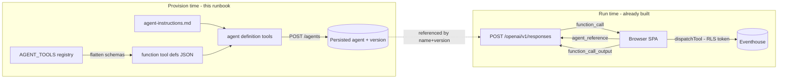

# Provisioning the Foundry agent's tool catalog

How to register Operations IQ's client-side tools on the persisted Microsoft
Foundry agent so the model can call them.

> **TL;DR — just run the committed script.** The whole flow below is automated by
> `scripts/provision-foundry-agent.ts`:
>
> ```bash
> # 1. Preview the generated agent body (writes agent-tools.generated.json)
> npm run agent:emit
>
> # 2. Create/update the agent version (needs the env vars in §5 + `az login`)
> npm run agent:provision            # or: npm run agent:provision -- --dry-run
> ```
>
> The sections below explain what the script does and how to do it by hand if you
> ever need to. See "§10. The committed script" for the runnable tooling.

> Companion docs: `agent-instructions.md` (the agent's behavior contract / system
> instructions) and `agent-tool-design.md` (how a tool shapes its result). This file
> covers the **wiring**: getting the tool *definitions* onto the agent.

---

## 1. Mental model: where each piece lives

Foundry's "function calling" is a **built-in tool type**. With a hosted agent
(`agent_reference`), the agent definition owns the model, the instructions, **and**
the function‑tool *schemas*. The Responses API **rejects a request‑level `tools`
array** when an agent is referenced (this is the `invalid_payload` error that
prompted this work). So the split is:

| Concern | Lives where | Owned by |
| --- | --- | --- |
| Model deployment | Agent definition (`definition.model`) | Foundry (provisioned) |
| System instructions | Agent definition (`definition.instructions`) | `agent-instructions.md` → Foundry |
| Function‑tool **schemas** (name/description/parameters) | Agent definition (`definition.tools`) | **This runbook** |
| Function **execution** (the `run()` adapters, RLS/Kusto token, charts) | Browser SPA | `src/lib/agent/**` (unchanged) |
| The call/return loop (`function_call` → execute → `function_call_output`) | Browser SPA | `foundryClient.ts` (already implemented) |

The runtime loop already works. The only missing link is **publishing the tool
schemas into the agent definition**, which is a provisioning-time step done with the
SDK or REST (the portal can run function-tool agents but cannot add/edit function
definitions).



---

## 2. The function-tool definition shape

A function tool inside `definition.tools` uses the **flattened** Responses-API shape:

```jsonc
{
  "type": "function",
  "name": "forecast",
  "description": "Forecast a tag's future values ...",
  "parameters": {           // standard JSON Schema (object)
    "type": "object",
    "properties": { /* ... */ },
    "required": ["tagId", "startIso", "endIso", "horizonPoints"]
  },
  "strict": false            // optional; see §4
}
```

⚠️ This is **not** the shape `registry.toolDefinitions()` returns. That helper emits
the Chat‑Completions **nested** shape `{ type: "function", function: { name, … } }`.
For the agent definition you need the flattened shape — exactly what the (now
removed) `responsesToolDefs()` produced. The generator in §3 does this flattening.

---

## 3. Step 1 — Generate the tool-definition JSON from the registry

The flattened function-tool defs are produced by **`functionToolDefs()`** in
`src/lib/agent/registry.ts` — the single source of truth. You do not need to write
any throwaway code: run the committed generator, which loads the registry under
Node and writes the full agent body.

```bash
cd OperationsIQApp
npm run agent:emit
# -> writes agent-tools.generated.json (name + definition{model,instructions,tools})
#    with ~47 flattened function tools. The file is git-ignored (build artifact).
```

`AGENT_TOOLS` is browser code: each tool module imports browser-only deps (Kusto
client, MSAL, canvas chart rendering), so a plain Node `import` of the registry
fails. The generator runs under `scripts/provision.vite.config.ts`, a Vite config
that resolves those leaf modules (`msal`, `rayfinClient`, `echarts`) to Node-safe
stubs in `scripts/stubs/`. Provisioning only reads tool *metadata*
(name/description/parameters) and never calls `run()`, so the stubs are inert.

> Prefer `functionToolDefs()` over `toolDefinitions()`: the latter returns the
> Chat-Completions **nested** shape `{ type, function: { name, … } }`, which the
> agents API rejects. `functionToolDefs()` returns the flattened shape from §2.

## 4. Step 2 — Decide on `strict` mode (leave it OFF)

Keep function tools **non-strict** (omit `strict`, or set `false`). Strict mode
requires: every property listed in `required`, `additionalProperties: false` on
every object, and only a restricted JSON-Schema keyword subset. Operations IQ's
schemas are not strict-compatible today:

- Many tools have **optional** parameters (`confidence`, `threshold`, `aggregation`,
  …) that are intentionally absent from `required`.
- Schemas use `default`, `minimum`, `maximum`, `integer` (e.g. `forecast`). These
  are accepted and ignored in non-strict mode, but restricted under strict.
- `set_page_params` (in `uiControlTools.ts`) uses `additionalProperties: true` for a
  free-form param bag — invalid under strict.

Non-strict is safe here because **the client re-validates every call** in
`dispatchTool` via `validateArgs(tool.parameters, …)` before running the adapter, so
argument correctness does not depend on the model honoring the schema.

## 5. Step 3 — Create / update the agent version

**Preferred: `npm run agent:provision`** (see §10) does everything below —
generates tools from the registry, extracts instructions from the fenced block in
`agent-instructions.md`, acquires a token, and POSTs the agent body. The manual
options here remain as a reference / fallback.

**Create vs. update — two different endpoints.** The agents API is version-based,
but create and update are **separate calls**, so `agent:provision` picks the right
one automatically:

- **Create** (new agent): `POST {endpoint}/agents?api-version=v1` with the name in
  the body. This returns **HTTP 409 `conflict` ("Agent 'X' already exists")** if the
  name is already taken, so it is only used for brand-new agents.
- **Update** (new version of an existing agent): `POST
  {endpoint}/agents/{name}?api-version=v1` with the name in the **URL path** and a
  body that omits the top-level `name` (just `definition` + optional `description`).
  The service adds a new version when the definition changed and returns the latest
  version otherwise. Old versions are retained; an unpinned `agent_reference`
  resolves to the latest.

Before POSTing, the script does a best-effort `GET {endpoint}/agents/{name}` and
logs either `Creating new agent 'X'` (then hits the create endpoint) or `Updating
existing agent 'X' (current version N)` (then hits the update endpoint). That check
never blocks provisioning if it fails, and the POST route is chosen from its result.
To push a change to an already-provisioned agent, just re-run `agent:provision` and
bump `VITE_FOUNDRY_AGENT_VERSION` (§6) to the returned version.

The agent is created at `POST {endpoint}/agents?api-version=v1` and re-versioned at
`POST {endpoint}/agents/{name}?api-version=v1`.
Note the two different base paths on the same project endpoint:

- **Agent admin:** `{endpoint}/agents?api-version=v1` (create) /
  `{endpoint}/agents/{name}?api-version=v1` (update)
- **Runtime data plane:** `{endpoint}/openai/v1/{conversations,responses}` (what the SPA uses)

where `{endpoint}` = `https://<resource>.services.ai.azure.com/api/projects/<project>`
(the value of `VITE_FOUNDRY_ENDPOINT`). Token audience: `https://ai.azure.com/.default`.

### Option A — Node one-liner (fetch + az token)

```js
// provision.mjs  (run from repo root:  node provision.mjs)
import { readFileSync } from 'node:fs';
import { execSync } from 'node:child_process';

const ENDPOINT = process.env.FOUNDRY_PROJECT_ENDPOINT; // https://<res>.services.ai.azure.com/api/projects/<proj>
const AGENT_NAME = process.env.FOUNDRY_AGENT_NAME ?? 'operations-advisor';
const MODEL = process.env.FOUNDRY_MODEL;                // e.g. gpt-4.1  (a VISION model if VITE_OPERATIONS_ADVISOR_VISION=true)

const tools = JSON.parse(readFileSync('OperationsIQApp/agent-tools.generated.json', 'utf8'));
// Use the "System instructions" block from agent-instructions.md as the source of truth.
const instructions = readFileSync('OperationsIQApp/docs/agent-instructions.md', 'utf8');

const token = execSync(
  'az account get-access-token --scope https://ai.azure.com/.default --query accessToken -o tsv',
).toString().trim();

const res = await fetch(`${ENDPOINT}/agents?api-version=v1`, {
  method: 'POST',
  headers: { Authorization: `Bearer ${token}`, 'Content-Type': 'application/json' },
  body: JSON.stringify({
    name: AGENT_NAME,
    description: 'Operations Advisor — tools provisioned from AGENT_TOOLS',
    definition: { kind: 'prompt', model: MODEL, instructions, tools },
  }),
});
const body = await res.json();
if (!res.ok) throw new Error(`Provision failed (${res.status}): ${JSON.stringify(body)}`);
console.log(`Agent '${body.name}' version '${body.version}' provisioned with ${tools.length} tools`);
```

### Option B — TypeScript SDK (`@azure/ai-projects`)

```ts
import { DefaultAzureCredential } from '@azure/identity';
import { AIProjectClient } from '@azure/ai-projects';
import toolDefs from './agent-tools.generated.json' assert { type: 'json' };

const project = new AIProjectClient(process.env.FOUNDRY_PROJECT_ENDPOINT!, new DefaultAzureCredential());

const agent = await project.agents.createVersion('operations-advisor', {
  kind: 'prompt',
  model: process.env.FOUNDRY_MODEL!,
  instructions: /* System instructions block from agent-instructions.md */ '',
  tools: toolDefs, // flattened { type:'function', name, description, parameters }
});
console.log(`Provisioned ${agent.name} v${agent.version}`);
```

### Option C — REST (curl), single tool shown for brevity

```bash
ENDPOINT="https://<resource>.services.ai.azure.com/api/projects/<project>"
TOKEN=$(az account get-access-token --scope https://ai.azure.com/.default --query accessToken -o tsv)

curl -X POST "$ENDPOINT/agents?api-version=v1" \
  -H "Authorization: Bearer $TOKEN" -H "Content-Type: application/json" \
  -d '{
    "name": "operations-advisor",
    "description": "Operations Advisor",
    "definition": {
      "kind": "prompt",
      "model": "<MODEL_DEPLOYMENT>",
      "instructions": "You are the Operations Advisor ...",
      "tools": [
        { "type": "function", "name": "forecast", "description": "...",
          "parameters": { "type": "object", "properties": { "tagId": {"type":"string"} }, "required": ["tagId"] } }
      ]
    }
  }'
```

Each `POST` to the same `name` creates a **new version**; the old version is
retained. `agent_reference` without a version resolves to the latest.

## 6. Step 4 — Pin the app to the provisioned agent

Set the SPA env (`.env.local`) to the returned name/version:

```dotenv
VITE_FOUNDRY_ENDPOINT=https://<resource>.services.ai.azure.com/api/projects/<project>
VITE_FOUNDRY_AGENT_NAME=operations-advisor
VITE_FOUNDRY_AGENT_VERSION=3          # the version returned by provisioning (recommended to pin)
VITE_FOUNDRY_SCOPE=https://ai.azure.com/.default
```

`foundryClient.ts#agentReference()` already sends `{ name, type: 'agent_reference',
version? }`, so no client code changes are needed.

## 7. Verify

1. `agent-tools.generated.json` tool count ≈ `AGENT_TOOLS.length` (~47).
2. A `POST /openai/v1/responses` with `agent_reference` returns output whose
   `output[]` contains a `function_call` item for a tool question (e.g. "forecast
   tag X").
3. The SPA executes it (`dispatchTool`) and the follow-up response yields a
   natural-language answer — no `invalid_payload` error.
4. In Foundry tracing, confirm the tool invocation appears.

---

## 8. Do the existing tools need to change? — **No adapter changes required**

| Aspect | Verdict | Notes / action |
| --- | --- | --- |
| `run()` adapters, `ToolResult`, client dispatch | ✅ No change | Client-side execution + the `function_call`/`function_call_output` loop already exist in `foundryClient.ts`. |
| `parameters` JSON Schemas | ✅ Compatible (non-strict) | No `oneOf`/`anyOf`/`allOf`/`$ref`/`$defs` used anywhere. `enum`, `minimum`, `maximum`, `default`, `integer`, `additionalProperties` are all fine in non-strict mode. |
| Definition **shape** | ⚙️ Transform only | Publish the **flattened** shape (§2/§3), not `toolDefinitions()`'s nested shape. This is a build-time transform, not a source change. |
| `strict` mode | ⚠️ Keep OFF | Optional params, numeric keywords, and `set_page_params`' `additionalProperties:true` are strict-incompatible. Non-strict is safe — the client re-validates args (`validateArgs`). |
| Tool **naming** | ✅ Compliant | `snake_case`, unique (enforced by `registry.buildIndex`), matches Foundry/OpenAI convention. |
| Side-effecting tools (`readOnly:false`) | ✅ No change, be aware | `create_investigation`, `add_annotation`, `save_derived_metric`, and UI `navigate`/`set`/`run` are still gated client-side by `policy.checkToolPolicy` + `ToolContext.allowSideEffects`. The model may *emit* the call; the SPA refuses it unless the user opted in. |
| Tool **count** (~47) | ✅ OK, monitor | Within model limits (≈128), but ~47 schemas add prompt overhead per turn. If it grows or dilutes tool selection, consider grouping into a **Toolbox** (MCP-compatible bundle) or trimming rarely-used tools. |
| Multimodal / vision | ➕ Config, not code | `VITE_OPERATIONS_ADVISOR_VISION=true` sends chart PNGs on a follow-up message; provision the agent with a **vision-capable model** or the review pass silently degrades. |

### The only real "modification": keep three surfaces in sync
The schemas now live in **three** places that must not drift:
1. `src/lib/agent/**` — the source of truth (`parameters` + `run`).
2. The generated `agent-tools.generated.json` → the **agent definition**.
3. `agent-instructions.md` — the prompt that tells the model these tools exist.

Re-run §3 + §5 whenever a tool's name, description, or `parameters` changes, cut a
new agent version, and bump `VITE_FOUNDRY_AGENT_VERSION`. Stamp the agent
`description` with the git SHA (as `agent-instructions.md` already suggests) so drift
is auditable. Automating this (CI job that regenerates + provisions on change) is the
natural follow-up if manual sync proves error-prone.

---

## 9. Alternatives considered (why plain function calling)

- **Toolbox / MCP endpoint** — bundles tools behind one MCP endpoint with central
  auth. Overkill here: our tools must execute *in the browser* under the user's
  delegated Kusto token + RLS, which an MCP server can't do. Revisit only if tool
  count balloons or tools are shared across agents.
- **OpenAPI tool** — Foundry calls an HTTP API directly (server-side). Incompatible
  with the RLS/"execute in the SPA" model; would move data access off the user's
  token.
- **Inline/ephemeral agent** (pass `model`+`instructions`+`tools` per request, no
  `agent_reference`) — technically allows request-level `tools`, but the app is
  deliberately built around a persisted, versioned agent whose model/instructions
  live server-side. Not chosen.

---

## 10. The committed script

Everything above is automated by committed, runnable tooling. No throwaway files.

| Path | Role |
| --- | --- |
| `src/lib/agent/registry.ts` → `functionToolDefs()` | Source of truth for the flattened function-tool defs. |
| `src/lib/agent/provisioning.ts` | Pure helpers: `extractSystemInstructions()`, `buildAgentBody()`, `agentsUrl()`. Unit-tested (`provisioning.test.ts`). |
| `scripts/provision-foundry-agent.ts` | CLI: `--emit`, `--provision`, `--dry-run`. Owns fs/fetch/`az`. |
| `scripts/provision.vite.config.ts` | Vite config that stubs browser-only leaves so the registry loads under Node. |
| `scripts/stubs/{msal,rayfinClient,echarts}.ts` | Inert stand-ins used only during provisioning. |

### npm scripts

```jsonc
"agent:emit":      "vite-node --config scripts/provision.vite.config.ts scripts/provision-foundry-agent.ts -- --emit",
"agent:provision": "vite-node --config scripts/provision.vite.config.ts scripts/provision-foundry-agent.ts -- --provision"
```

### Usage

```bash
cd OperationsIQApp

# Preview only — writes agent-tools.generated.json (git-ignored):
npm run agent:emit

# Create/update the agent version. Requires the env vars below + `az login`
# (or FOUNDRY_TOKEN). Add `-- --dry-run` to print the request without sending.
FOUNDRY_PROJECT_ENDPOINT="https://<res>.services.ai.azure.com/api/projects/<proj>" \
FOUNDRY_AGENT_NAME="operations-advisor" \
FOUNDRY_MODEL="gpt-4.1" \
npm run agent:provision
```

| Env var | Required | Purpose |
| --- | --- | --- |
| `FOUNDRY_PROJECT_ENDPOINT` | provision | Project endpoint (same as `VITE_FOUNDRY_ENDPOINT`). |
| `FOUNDRY_AGENT_NAME` | provision | Agent name to create/version. |
| `FOUNDRY_MODEL` | provision | Model deployment name (a vision model if the app uses `VITE_OPERATIONS_ADVISOR_VISION=true`). |
| `FOUNDRY_AGENT_DESCRIPTION` | optional | Human-readable description. |
| `FOUNDRY_INSTRUCTIONS_FILE` | optional | Defaults to `docs/agent-instructions.md`. |
| `FOUNDRY_API_VERSION` | optional | Defaults to `v1`. |
| `FOUNDRY_TOKEN` | optional | Bearer token; falls back to `az account get-access-token`. |

The instructions come from the fenced block under **`## System instructions`** in
`agent-instructions.md`. After provisioning, pin the app to the new version per §6.
