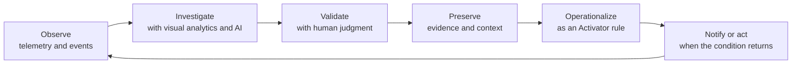
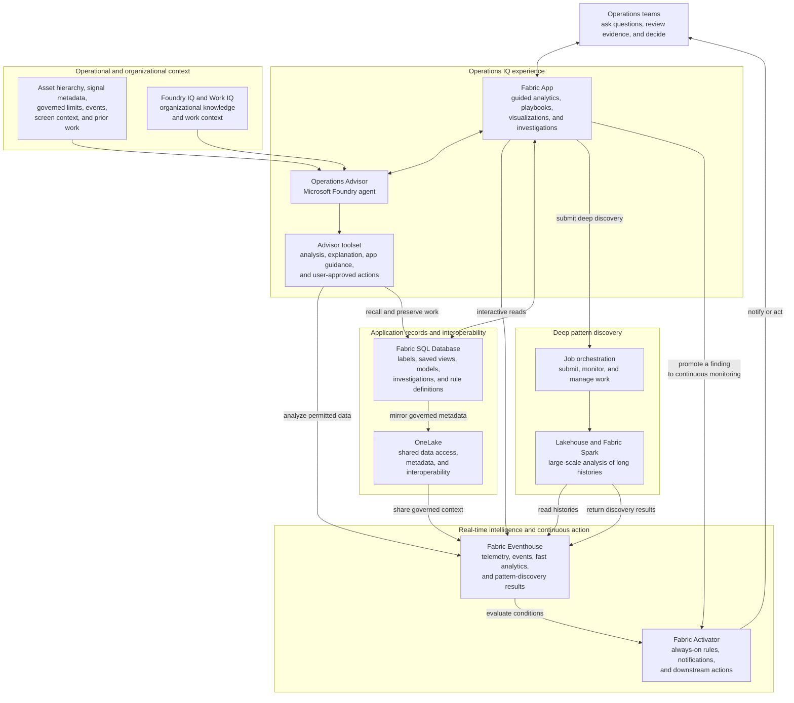

# Operations IQ

**From telemetry, to AI-augmented insight, to human judgment, to always-on
operational vigilance.**

Every company is an operations company. Manufacturing lines, energy grids,
data centers, cold chains, fleets, refineries, and financial processes all
depend on people who must keep the business safe, reliable, efficient,
compliant, and improving.

Most operational systems can show the current state, but can't answer the harder questions:

- Why did output drop?
- Is this spike a real problem or just noise?
- Which signal changed first, and what else changed with it?
- Has this pattern happened before or appeared on another asset?
- Are we drifting toward a limit?
- Once we recognize a warning signature, how do we catch it next time before
  it has an impact?

**Operations IQ** is a deployable analytical suite built on Microsoft Fabric
and Microsoft Foundry. It turns time-ordered operational data into guided
research, visual evidence, AI-assisted investigation, and continuous
oversight.

## The value of Operations IQ

Operations IQ helps teams move through a complete operational intelligence
cycle:

1. **See what is happening.** Explore and annotate trends, comparisons,
   heatmaps, volatility, frequency patterns, and live views.
2. **Understand why.** Examine relationships across many signals with
   influence maps, root-cause analysis, regression, decomposition, and change
   detection.
3. **Detect what people and simple thresholds miss.** Monitor deviations,
   process-control rules, sensor health, and coordinated anomalies across
   multiple signals.
4. **Discover what matters in long histories.** Find repeated operating
   signatures, rare events, regime changes, slow degradation, and fleet-wide
   patterns.
5. **Plan what comes next.** Forecast future behavior and test what-if
   scenarios.
6. **Preserve the evidence.** Turn charts, results, annotations, and reasoning
   into reusable investigations.
7. **Never miss the same signal twice.** Promote a discovered condition into
   an always-on Microsoft Fabric Activator rule that can notify people or
   trigger an action when it returns.


## Meet Operations Advisor

Operational analysis can be complex, but users do not have to work alone.
**Operations Advisor** is an AI assistant built with Microsoft Foundry and
embedded directly in Operations IQ.

The Advisor is grounded in the user's operational context: the asset
hierarchy, signal descriptions, governed operating limits, events, data
coverage, prior investigations, and the page currently on screen. Foundry IQ
and Work IQ can extend that grounding with organizational knowledge and work
context.

Operations Advisor can:

- translate a plain-language question into a structured investigation;
- use dozens of specialized analytical tools for exploration, forecasting,
  anomaly detection, pattern search, relationship analysis, and simulation;
- guide the user through more than 100 scenario-based playbooks;
- navigate the application, set analysis inputs, and run visible analyses when
  the user grants control;
- explain methods, assumptions, uncertainty, and limitations;
- capture charts, data, notes, and deep links into an investigation; and
- help turn a confirmed finding into repeatable monitoring.

The Advisor shows its work through synchronized charts and evidence rather than
asking users to trust an unexplained answer. AI performs machine-scale
computation and coordinates analytical tools; the operator supplies context,
judgment, and the decision. App control and write actions require explicit user
permission.

> **The goal is not to replace operator judgment. It is to amplify human
> agency by combining AI reasoning with the human visual system, experience,
> intuition, and accountability.**

## Capabilities

| Operational need | How Operations IQ helps |
| --- | --- |
| **Explore behavior** | Review trends, volatility, heatmaps, comparisons, frequency content, derived measures, and live data. Brush across a chart to focus on the period that matters. |
| **Explain relationships** | Compare multiple signals, identify what moved first, rank likely contributors, quantify associations, separate trend and seasonality, and locate meaningful changes. |
| **Monitor process health** | Detect deviations from expected behavior, apply statistical process-control rules, validate sensors, and reveal coordinated anomalies that single-signal thresholds can miss. |
| **Search for known signatures** | Select a pattern on a chart and find similar shapes elsewhere in the same signal, in earlier periods, or across other signals and assets. |
| **Mine long histories** | Discover recurring motifs (repeated shapes), discords (rare shapes), operating regimes, gradual degradation, and multi-sensor patterns at scale. |
| **Plan ahead** | Forecast signals, estimate when a limit may be reached, and compare what-if scenarios before changing the real process. |
| **Build an evidence trail** | Annotate charts and save investigations containing readable summaries, chart images, underlying data, notes, and links that restore the analysis. |
| **Maintain continuous vigilance** | Convert a valuable finding into a Fabric Activator rule that keeps monitoring after the browser is closed and can send notifications or start downstream actions. |

## Guided playbooks for real operational scenarios

Operations IQ includes **more than 100 playbooks across 16 industries, plus
cross-industry business functions**. A playbook turns a goal such as
"investigate a compressor anomaly" or "diagnose underperformance" into a
guided sequence of analyses.

The library covers areas such as:

- oil and gas, power and renewables, manufacturing, chemicals, water, mining,
  buildings, and data centers;
- pharmaceuticals, food and beverage, automotive, aerospace, transportation,
  semiconductors, marine operations, and agriculture; and
- cross-industry functions such as finance, sales, marketing, and workforce
  operations.

Users can follow a playbook themselves or ask Operations Advisor to carry it
out with them. For example, the Advisor can investigate a compressor anomaly
across speed, vibration, temperature, pressure, and displacement signals,
identify what changed, search for earlier occurrences, and preserve the
evidence.

## Closing the loop from insight to action

A key differentiator of Operations IQ is that analysis does not end with a
chart or an AI response.



A discovered signature can immediately seed a similarity search across time
and assets. Once validated, that pattern or anomaly can become an advanced
Fabric Activator rule. Monitoring continues even when the browser is closed
and the operator has stepped away.

## Solution architecture

Operations IQ activates a broad set of Microsoft Fabric and Foundry services.
The architecture separates the interactive user experience, AI assistance,
fast time-series analysis, large-scale discovery, application records, and
continuous action while keeping them in one governed platform.



### What each service contributes

- **Fabric Apps** provides the secure, interactive Operations IQ user
  experience.
- **Microsoft Foundry** powers Operations Advisor, which reasons over context
  and coordinates analytical tools. **Fabric IQ**, **Foundry IQ**, **Work IQ** and even **Web IQ** can add
  organizational knowledge, work context, and fresh real-world intelligence.
- **Fabric Eventhouse** stores and analyzes high-volume, time-ordered telemetry
  and events, and serves interactive analytical results.
- **Fabric SQL Database** stores application records such as labels, saved
  analyses, models, investigations, and alert definitions.
- **OneLake** provides a shared data layer for interoperability and governed
  metadata exchange across Fabric services.
- **Lakehouse and Fabric Spark** perform computationally intensive discovery
  across long histories and many signals.
- **Fabric Activator** keeps watch continuously and can notify people or invoke
  an action when a monitored condition returns.

### Secure and human-controlled by design

- Operational data is read under the signed-in user's identity, so existing
  permissions continue to apply.
- The application is read-only against source telemetry during interactive
  analysis; annotations, investigations, and other user work are stored
  separately.
- Operations Advisor is read-only by default. Controlling the visible app or
  changing saved state requires explicit user consent.
- Analytical results are accompanied by visual evidence, assumptions, and
  caveats so users can review how a conclusion was reached.

## Key terms

| Term | Plain-language meaning |
| --- | --- |
| **Telemetry** | Measurements recorded over time, such as temperature, pressure, vibration, output, latency, or financial volume. |
| **Signal** | One measured quantity tracked over time. |
| **Multivariate analysis** | Analysis of several related signals together, which can reveal system behavior that is invisible in any one signal. |
| **Motif** | A shape or behavior that repeats in a time series. |
| **Discord** | A rare or unusual shape in a time series that may deserve investigation. |
| **Investigation** | A saved case containing findings, notes, charts, data, and links back to the original analysis. |
| **Eventhouse** | A Microsoft Fabric service optimized for ingesting and analyzing high-volume, time-ordered data. |
| **Lakehouse and Spark** | Fabric services used for large-scale data preparation and computationally intensive analysis. |
| **Activator** | A Fabric service that continuously evaluates conditions and can notify people or trigger actions. |
| **Foundry** | Microsoft's platform for building and governing AI applications and agents. |

## Repository overview

```text
.
|-- OperationsIQApp/     # The application and its Fabric solution components
|   |-- src/             # User experience and Operations Advisor integration
|   |-- eventhouse/      # Time-series data model and analytical functions
|   |-- rayfin/          # Fabric App data model and application persistence
|   |-- spark/           # Large-scale pattern-discovery jobs
|   |-- orchestration/   # Submission and monitoring of deep-discovery jobs
|   |-- deploy/          # Modular deployment automation
|   `-- docs/            # Detailed design, runbook, and agent references
|-- docs-site/           # User, administrator, and developer documentation
`-- scripts/             # Repository setup scripts
```

## Get started

Install the application, documentation, and Python dependencies with the
repository bootstrap:

```powershell
node scripts/bootstrap.mjs
```

Then configure and run the application:

```powershell
cd OperationsIQApp
Copy-Item .env.example .env.local
# Fill in the environment-specific values described in OperationsIQApp/README.md
npm run dev
```

For a Fabric deployment:

```powershell
cd OperationsIQApp/deploy
pwsh ./Deploy-All.ps1 -ConfigFile ./config/deploy.config.json
```

See the setup and deployment documentation below for prerequisites, identity,
permissions, and configuration.

## Documentation

- **[Application overview and setup](OperationsIQApp/README.md)** - detailed
  capabilities, configuration, and local development.
- **[User Guide](docs-site/docs/user/index.md)** - getting started, exploring,
  diagnosing, planning, discovering patterns, alerts, investigations, personas,
  and terminology.
- **[Administrator Guide](docs-site/docs/admin/index.md)** - architecture,
  prerequisites, deployment, identity, permissions, governance, and operations.
- **[Developer Guide](docs-site/docs/dev/index.md)** - repository structure,
  frontend design, data model, analytical functions, extension points, testing,
  and Operations Advisor design.
- **[Target architecture and design decisions](OperationsIQApp/docs/design-spec.md)**
  - the detailed design specification behind this solution.
- **[Deployment runbook](OperationsIQApp/docs/runbook.md)** - the
  code-versioned operational deployment reference.
- **[Operations Advisor instructions](OperationsIQApp/docs/agent-instructions.md)**
  and **[tool design](OperationsIQApp/docs/agent-tool-design.md)** - the AI
  assistant's behavior, safety model, and analytical tools.
- **[Automated deployment](OperationsIQApp/deploy/README.md)** - modular
  deployment orchestration.

### Run the documentation site locally

```powershell
cd docs-site
npm install
npm run start
```
