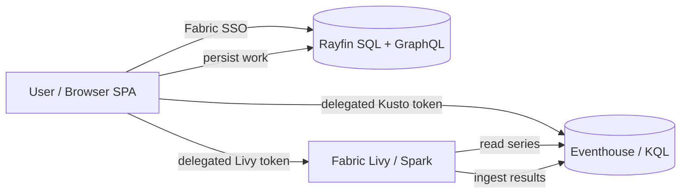

# Architecture

Operations IQ is a single-page application (SPA) that runs inside Microsoft
Fabric. It reads time-series data directly from a Fabric **Eventhouse** and
persists user work to the **Rayfin** (Fabric Apps) backend. Heavy pattern
discovery runs as **Spark** jobs.

## Two independent auth contexts

Two authentication contexts run side by side in the browser:

| Concern | Mechanism | Reaches |
| --- | --- | --- |
| Identity + persistence (labels, saved searches, models, investigations) | Fabric SSO via `RayfinClient` | Rayfin GraphQL over Fabric SQL |
| Time-series reads + SAX functions | MSAL.js public client (PKCE) | Eventhouse `/v2/rest/query` |

Rayfin sessions are **opaque** and cannot mint a Kusto token, so a **separate**
MSAL public client (its own Entra SPA registration) acquires a Kusto-audience
token and queries the Eventhouse directly.

## Read-only browser, writes to Rayfin

- The browser is **read-only** against the Eventhouse. Reads run under the
  **user's delegated token**, so Eventhouse RLS and database roles are honored.
- **All writes go to Rayfin SQL** via GraphQL — labels, saved searches, models,
  signal metadata, investigations, and evidence.
- SAX-VSM models are *trained* in the Eventhouse (read-only) and their term
  weights are persisted to Rayfin; classification passes the model back inline as
  a KQL `datatable` literal — **no Eventhouse write access is required**.

## Pattern discovery (Spark)

The Patterns / Matrix Profile module submits and monitors Spark jobs **directly
from the browser** against the Fabric **Livy** REST endpoint, using the user's
delegated token. The Spark job reads the source series and **ingests results into
the Eventhouse** using the cluster's managed identity. See
[Spark compute](./spark-compute).

## Data flow

## Component map

- **Frontend** — React + TypeScript + Vite + Fluent UI (`OperationsIQApp/src`).
- **Eventhouse** — schema + SAX function library (`OperationsIQApp/eventhouse`).
- **Spark** — PySpark Matrix Profile core (`OperationsIQApp/spark`).
- **Orchestration** — optional server-side dispatcher (`OperationsIQApp/orchestration`).
- **Rayfin data** — entity classes and schema (`OperationsIQApp/rayfin/data`).

For a deeper code-level view, see the [Developer Guide](/dev/).
